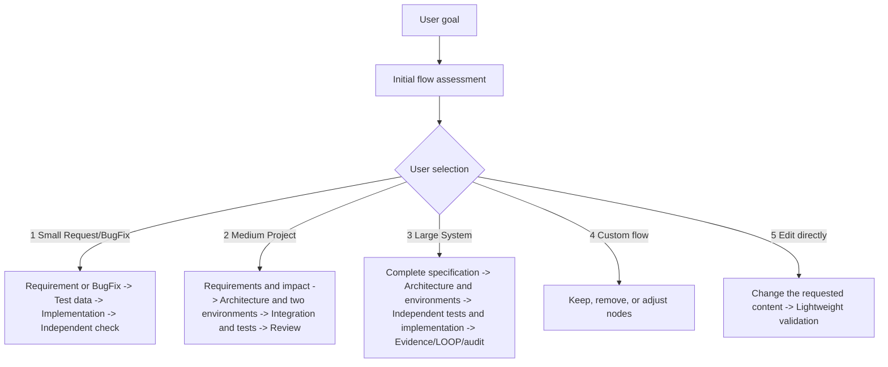

# Goal Teams

[中文](README.md) | English

Author: 肉山@TGO Hangzhou

<!-- goal-teams-release:start -->
Current release: **V2.50** · [GitHub Release](https://github.com/vibe-coding-era/goal-teams/releases/tag/v2.50) · [release/current/README.md](release/current/README.md)
<!-- goal-teams-release:end -->

V2.50 is the current published release. It isolates Current rules from Legacy Replay and loads rules by functional template. Medium/Large development blocks only on TDD and affected-scope checks; full regression and a security review run only when implementation is complete and a Release is being prepared.
S2 builds each exact released asset set once, and S3 applies only to a Large Release. External writes are authorized once at project start; GitHub Git remotes use SSH only.

Current version: `V2.50`

Goal Teams is a cross-CodeAgent coordination Skill, with Codex as one available host. It turns one goal into a verifiable plan and lets a Goal Lead coordinate independent members across requirements, design, implementation, tests, evidence, and completion audit. V2.50 uses a thin Bootstrap, an immutable Current generation, and explicit Replay so historical rules do not enter normal tasks. A complete adapter still requires host-specific runtime evidence.

## Core Mechanisms

### Goal + Plan + Loop

Goal Teams splits complex collaboration into three layers:

- Goal defines the target and Done Criteria, so the team agrees on what completion means.
- Plan turns the target into members, Subagent contexts, scope, handoff artifacts, verification method, and stop conditions. This reduces scope drift and concurrent-edit conflicts.
- Loop records `loop_decision=continue|replan|stop` after each integration and keeps `run_outcome`, task/check state, and stop reasons orthogonal for recovery and audit.

The useful part is not simply running more agents. The useful part is that different roles work in isolated contexts while the Goal Lead keeps the target, scope, and evidence consistent. A chat request becomes an engineering process that can be traced.

### SPEC + Harness + SSOT

Goal Teams uses `SPEC -> Harness -> Evidence -> Audit` as the verification chain, with SSOT controlling handoff vocabulary:

- SPEC defines what should be completed, including requirements, boundaries, user stories, functional acceptance criteria, architecture, and test plan.
- Harness defines how completion is proven, including commands, scripts, E2E, screenshots, manual checklists, and evidence paths.
- SSOT defines the one authoritative handoff model, including artifact type, Owner, validator, status fields, and TaskList ledger format.

Together, these mechanisms make the Skill produce more than a plan. They create an evidence structure that members can execute, scripts can check, reviewers can inspect, and auditors can close. For complex application work, this is stronger than code output alone because completion must be proven.

### Benchmark

Goal Teams includes `benchmarks/` task packages for comparing workflow, prompt, or skill-version behavior. Benchmark is not a default output for ordinary tasks; it is used when the user asks for it, the plan confirms it, or a Skill Improvement task needs repeatable comparison.

The value is that benchmark results make improvement reviewable. The same task can compare baseline and Goal Teams behavior across output completeness, evidence quality, UI verification, production-gate judgment, Loop state recovery, and cost. This repository includes `GT-BENCH-001` through `GT-BENCH-005`, covering typical dimensions from basic output quality and Lead LOOP recovery to real API/E2E defect detection.

### Openness and External Skills

Goal Teams does not require every capability to come from a built-in subagent. During Plan, external skills, project scripts, browser tools, test tools, or user-selected subagents can be added to the `Teams 规划表` with locked scope, inputs, outputs, Harness, and validator.

This makes Goal Teams an orchestration layer. It keeps the goal, plan, handoff artifacts, and evidence consistent; concrete capabilities can come from `goal_*` subagents or external skills such as browser verification, document generation, security review, PDF/spreadsheet handling, or project-specific tools. Once an external capability joins the team, it still follows SSOT, Harness, and independent validation rules.

## Project Flow Selection

When Goal Teams is first used, it recommends a flow from the goal, available materials, and risk. Select a flow by number; a formal Plan, Teams table, or member dispatch begins only after confirmation.



Choose the next step:

1. Small Request/BugFix
2. Medium Project
3. Large System
4. Customize flow nodes
5. Edit directly: do not create a formal Plan or Teams table; change the requested content and run applicable lightweight validation

### Small Request/BugFix

Use for a focused, low-risk requirement or BugFix without cross-module, production-release, or security boundaries.

`Requirement/prototype (when UI applies) or BugFix diagnosis → Test cases and data → TDD and implementation → Tests and independent check`

- Project members: typically 1–2.
- Possible Subagents: 0–1.
- Typical roles: Goal Lead, implementation/testing, and lightweight independent review.

### Medium Project

Use for multiple modules, API or data boundaries, original UI, or differences between development and production environments.

`Requirement card, PRD, and impact analysis → Architecture Design plus development/production configuration plans → Prototype, tests, and data → TDD, implementation, and integration → Independent tests and Review`

- Project members: typically 3–5.
- Possible Subagents: 2–4.
- Typical roles: requirements/product, architecture or development, testing, QA/Reviewer.

### Large System

Use for multi-system work, releases, production changes, security-sensitive work, payments/authentication, or complex UI.

`Flow clarification, requirements specification, and PRD → Page prototype and architecture → Development/production configuration plans → Independent test design, Harness, and implementation → Evidence, Review, LOOP gap closure, and completion audit`

- Project members: typically 6–10.
- Possible Subagents: 5–8.
- Typical roles: Goal Lead, requirements/product, architecture, frontend/backend, test design and execution, QA, Reviewer, Auditor, and security or performance specialists when needed.

These are planning ranges. Adjust them to actual scope, risk, and available runtime capabilities. Security, release, or production boundaries keep their required gates even when a small flow is selected.

## Quickstart

Install into your local Codex skills directory:

```bash
git clone git@github.com:vibe-coding-era/goal-teams.git ~/.codex/skills/goal-teams
```

Install or refresh from this repository:

```bash
./scripts/install-local.sh --update-team-fallback
```

Run TDD and Current incremental checks during development:

```bash
./scripts/check.sh --phase development --project-size medium
```

After implementation is complete and the exact released commit/tree is frozen, first use a fresh process to produce a real runtime receipt bound to the Current prompt, trusted route, project-start authorization, and host adapter. Then run the final full regression and independent security review:

```bash
EVIDENCE_DIR=docs/v2.50-release-runtime
mkdir -p "$EVIDENCE_DIR"
SOURCE_COMMIT="$(git rev-parse 'HEAD^{commit}')"
SOURCE_TREE="$(git rev-parse "${SOURCE_COMMIT}^{tree}")"
ROUTE_RECEIPT="$EVIDENCE_DIR/large-release-route.json"
RUNTIME_RECEIPT="$EVIDENCE_DIR/released-runtime-transition.json"
S1_CHECK_RECEIPT="$EVIDENCE_DIR/s1-check-result.json"
AUTH_RECEIPT=docs/v2.50-execution/versions/V2.50/evidence/project-start-authorization-receipt.json
HANDOFF_RECEIPT="${HANDOFF_RECEIPT:?set the handoff receipt issued by the installed V2.48 Codex host}"
HOST_EXECUTION_ID="${HOST_EXECUTION_ID:?set the external host execution ID}"
PYTHON_BIN="$(python3 -c 'import pathlib,sys; print(pathlib.Path(sys.executable).resolve())')"

"$PYTHON_BIN" -c 'import json, pathlib, sys; from scripts.v250.generation_runtime import load_generation; from scripts.v250.route_closure import compile_route_closure; root=pathlib.Path(".").resolve(); pathlib.Path(sys.argv[1]).write_text(json.dumps(compile_route_closure(root, load_generation(root), "V250-ROUTE-LARGE-RELEASE"), ensure_ascii=False, sort_keys=True) + "\n", encoding="utf-8")' "$ROUTE_RECEIPT"

"$PYTHON_BIN" scripts/v250/runtime_host_adapter.py launch \
  --stage released --source-commit "$SOURCE_COMMIT" --source-tree "$SOURCE_TREE" \
  --project-size large --route-receipt "$ROUTE_RECEIPT" \
  --authorization-receipt "$AUTH_RECEIPT" \
  --controller-handoff-receipt "$HANDOFF_RECEIPT" \
  --host-execution-id "$HOST_EXECUTION_ID" \
  --adapter-identity local-external-runtime-host \
  --adapter-code scripts/v250/runtime_host_adapter.py > "$RUNTIME_RECEIPT"

./scripts/check.sh --phase release --project-size large \
  --source-commit "$SOURCE_COMMIT" --source-tree "$SOURCE_TREE" \
  --expected-host-execution-id "$HOST_EXECUTION_ID" \
  --released-runtime-receipt "$RUNTIME_RECEIPT" > "$S1_CHECK_RECEIPT"
```

The `controller-handoff-receipt` may only be issued outside the repository by the installed V2.48 Codex host; repository code never generates it. It binds the real previous run, one-time nonce, authorization, and exact commit/tree with the pinned owner SSH key. The adapter sends the launch receipt over stdin only after it knows the real child PID, then verifies the child acknowledgement. The resulting I1 receipt still proves correlated process and signed-handoff binding rather than external independence. `S1_CHECK_RECEIPT` closes only S0/S1; it is not proof that the Release is complete.

Copy subagents manually:

```bash
mkdir -p ~/.codex/agents
cp ~/.codex/skills/goal-teams/subagents/goal-*.toml ~/.codex/agents/
```

## Usage

Plan and wait for confirmation:

```text
Use $goal-teams。
请为“分时租赁 V3.0”做 Goal Teams 计划。
过程和结果保存到 `GoalTeamsWork-V3.0/`。
先生成带用户故事和功能验收标准的需求卡片，再生成需求规格卡和 PRD。
```

Execute directly:

```text
Use $goal-teams。
请直接执行：为 WIKI 列表 V2.0 规划并实现后端 API、页面验证、独立测试和验收文档。
仍然先展示 Teams 规划表作为执行记录，但不用等我确认。
```

Assign capabilities:

```text
Use $goal-teams。
需求分析使用 goal_requirements_analyst。
页面验证使用 browser skill。
测试成员使用 goal_qa。
安全审核使用 goal_reviewer，只读模式。
```

Use this identity line on an explicit Goal Teams invocation or when the session first needs to establish identity; do not repeat it when full context already exists:

```text
我是 Goal Teams Lead V2.50。
```

Core language rule: user communication and governance documents default to Chinese; code, comments, test names, fixtures, and product strings follow the target repository's conventions; keep identifiers, commands, paths, API names, config keys, subagent IDs, and exact references unchanged.

## Rule Entrypoints

`SKILL.md` is the trigger-oriented entrypoint. It keeps only the startup line, invariants, planning checks, failure-degradation summary, and progressive-loading routes. Detailed rules live in references and prompts, and are loaded by task type.

| File | Purpose |
| --- | --- |
| `RULES.md` | Response contract for the Goal Lead and members: execute first, report verified facts, and avoid unverified completion claims. |
| `SKILL.md` | Skill discovery entrypoint and loading router. Its `description` keeps trigger terms such as `$goal-teams`, `Goal Mode`, `Plan Mode`, `先规划`, `只规划`, and `需求卡片`. |
| `references/invariants.md` | Always-on invariants, hard boundaries, and failure-degradation protocol. |
| `references/compat.md` | `TaskList.md`/`tasklist.md`, script compatibility wrappers, member-package layout, and version sync rules. |
| `references/rules-ui.md` | UI, Page Specification Card, HTML Prototype MOCK, E2E, and pixel-comparison rules. |
| `references/rules-testing.md` | Backend architecture-first, TDD, API integration pytest, frontend E2E, and independent testing rules. |
| `references/verification-governance-protocol.md` | Historical Evidence applicability, orthogonal states, test contracts, Grill me, and adversarial testing. |
| `references/desktop-engineering-protocol.md` | Rust/Tauri desktop replication, Rust backend contracts, and cross-platform L1-L4 testing, with a machine manifest/schema/validator. |
| `references/rules-loop.md` | Lead LOOP, Loop Decision, Loop Gate, Budget Gate, and auto-continuation boundaries. |
| `prompts/packets/handoff-artifacts.md` | Handoff SSOT for artifact types, Owner, validator, status fields, and TaskList ledger format. |

## Workflow

1. Convert the user goal into Done Criteria.
2. Confirm project version, artifact version, and output directory.
3. If the user explicitly requests an in-chat `plan_preview` / no-write result, return the plan without creating files, a ledger, TaskList, or subagents. Other modes create or update `GoalTeamsWork-<project_version>/memory.md`, establish the versioned append-only ledger, and generate `TaskList.md` through the reducer.
4. Outside `plan_preview`, Plan Mode writes `spec/requirement-card.md` before the applicable PRD, architecture, test-plan, and acceptance artifacts.
5. Load UI, testing, or LOOP conditional rules as needed.
6. Show the four-column `Teams 规划表`, then dispatch independent members.
7. Each member works inside its locked scope and submits revision-bound events/patches, Harness, and Evidence; members do not edit the central TaskList.
8. The ledger owner merges events and renders the TaskList projection; the Goal Lead records `loop_decision` and `run_outcome` separately.
9. Before completion, launch a fresh read-only `goal_completion_auditor`. Gaps inside confirmed scope continue only in the current session when the host supports it; new scope, high-risk work, or authorization issues stop for the user.

## Output Layout

Default output directory:

```text
GoalTeamsWork-<project_version>/
  index.md
  memory.md
  versions/
    <artifact_version>/
      index.md
      TaskList.md
      ledger/events.jsonl
      ledger/checkpoint.json
      identity/registry.json
      plan.md
      progress.md
      decisions.md
      goal-packet.md
      spec/
        requirement-card.md
        requirement-spec-card.md
        PRD.md
        page-spec-card.md
        frontend-architecture-design.md
        backend-architecture-design.md
        HTML-prototype.html
        test-plan.md
        acceptance.md
      tests/
        unit/
        api-integration/
        e2e/
        reports/
      artifacts/
      harness/harness.json
      harness/traceability.json
      evidence/evidence.jsonl
      reviews/dual-review.json
      reviews/semantic-review.md
      audit/completion-audit.json
      capability/manifest.json       # when host capabilities need a record
      release/license-decision.json  # only when the repository owner authorizes GA
```

`tasklist.md` remains readable as legacy input; V2.3 writes only the reducer-generated `TaskList.md`. Machine paths are defined by `schemas/v2.3/goal-teams.schema.json`; root-level V1.8 `harness.yaml`, `evidence.jsonl`, and `pipeline-state.json` are legacy/optional protocol artifacts and do not form a V2.3 completion closure.

## Default Members

| Subagent ID | Main responsibility |
| --- | --- |
| `goal_requirements_analyst` | Clarification, research-assisted analysis, Requirement Specification Card, and PRD input. |
| `goal_agent_product_manager` | Agent PRD, capability contract, Prompt/Context/Cache, tool/approval matrix, composable product patterns, and acceptance input. |
| `goal_product` | PRD, acceptance criteria, prototype structure, and product review. |
| `goal_backend` | Domain model, storage, API, CLI, MCP, migrations, and integrations. |
| `goal_frontend` | UI, HTML prototype, browser verification, E2E, replica pixel comparison, and screenshot evidence. |
| `goal_unit_test_designer` | Backend TDD unit-test cases, assertions, and coverage notes. |
| `goal_unit_test_runner` | Backend TDD unit-test execution, red/green evidence, and failure reports. |
| `goal_api_integration_test_designer` | API integration scripts and test matrix, defaulting to Python + pytest. |
| `goal_api_integration_test_runner` | API integration execution, logs, reports, and failure responses. |
| `goal_e2e_test_designer` | E2E cases, viewport coverage, and component assertions after frontend work. |
| `goal_e2e_test_runner` | E2E execution, screenshots, traces, and console/network evidence. |
| `goal_qa` | Independent tests, integration tests, UI E2E, pixel-comparison acceptance, and test reports. |
| `goal_docs` | Acceptance, README, reports, and release notes; TaskList changes are handed off as events/patches. |
| `goal_reviewer` | Read-only review, architecture boundaries, security, coverage, compatibility, and risk. |
| `goal_completion_auditor` | Completion audit, unfinished-work checks, and session-scoped continuation suggestions. |

## Design Sources

| Principle or technology | Why Goal Teams uses it | Source |
| --- | --- | --- |
| Codex Skill | Goal Teams is a reusable workflow, not an app. A skill can package instructions, references, and scripts so Codex can follow the same workflow repeatedly. | [OpenAI Codex Agent Skills](https://developers.openai.com/codex/skills) |
| Trigger-oriented `description` | Codex can implicitly select a skill from its `description`, so the core use case and trigger words must be concise and front-loaded. | [OpenAI Codex Agent Skills: How Codex uses skills](https://developers.openai.com/codex/skills) |
| Progressive loading | Load a small entrypoint first, then read conditional rules only when needed. This reduces context use and avoids irrelevant rule noise. | [OpenAI Codex Agent Skills](https://developers.openai.com/codex/skills), [NN/g Progressive Disclosure](https://www.nngroup.com/articles/progressive-disclosure/) |
| SSOT | Handoff artifacts, Owner, validator, and status fields need one authority so member packets, TaskList, and acceptance records do not diverge. | [Atlassian: Single Source of Truth](https://www.atlassian.com/work-management/knowledge-sharing/documentation/building-a-single-source-of-truth-ssot-for-your-team), `prompts/packets/handoff-artifacts.md` |
| OKF Markdown | Goal Teams artifacts must be readable by people and agents. OKF uses Markdown plus YAML frontmatter, which works well with version control, indexing, and exchange across tools. | [GoogleCloudPlatform Open Knowledge Format SPEC](https://github.com/GoogleCloudPlatform/knowledge-catalog/blob/main/okf/SPEC.md), `references/google-okf-bilingual-spec.md` |
| Requirements-to-test traceability | Requirements, tests, evidence, and acceptance need links so the team can decide whether the work is actually complete. | [NASA Software Test Procedures](https://swehb.nasa.gov/display/SWEHBVD/5.14%2B-%2BTest%2B-%2BSoftware%2BTest%2BProcedures?desktop=true&macroName=show-if) |
| TDD | Backend work writes tests before implementation to turn requirements into executable constraints and expose drift early. | [Martin Fowler: Test-Driven Development](https://martinfowler.com/bliki/TestDrivenDevelopment.html) |
| pytest | API integration defaults to Python + pytest because pytest keeps tests readable, gives clear failure output, and scales to larger suites. | [pytest documentation](https://docs.pytest.org/en/stable/) |
| Playwright E2E | UI work needs browser-level evidence. Playwright supports browser selection, viewport coverage, traces, screenshots, and pytest integration. | [Playwright Python Pytest plugin](https://playwright.dev/python/docs/test-runners), `references/ui-e2e-pixel-protocol.md` |
| Lead LOOP | Long tasks often fail because evidence gaps, scope drift, and state loss appear mid-run. Loop Decision records what happened after each integration. | `references/rules-loop.md`, `prompts/lead/loop.md` |

## Examples and Regression Checks

`examples/mini-goal-run` provides a minimal output tree for checking index files, SPEC, TaskList, Teams planning, Harness, Evidence, independent validation, and completion audit.

`benchmarks/` provides `GT-BENCH-001` through `GT-BENCH-005` for comparing baseline and Goal Teams behavior across output quality, evidence completeness, production gate judgment, UI evidence handling, Lead LOOP state recovery, real API/E2E defect detection, and cost.

`goal-teams.md` records long-term user requirements and is the upstream source for maintaining runtime rules.

## Version Note

The current product version is read from `VERSION`. V2.50 keeps the V2.5 portable core while loading one digest-bound Current generation; V2.3 and later historical contracts are available only through explicit Legacy Replay and do not enter default prompt or package closure.

Medium/Large development blocks only on TDD and affected-scope checks. Final Release readiness runs full regression plus an independent security review, builds each exact released asset set once, runs S3 only for Large, and reuses the one project-start authorization for S4.

See the [current release note](release/current/README.md) for the visible package inventory. It does not replace runtime rules, `VERSION`, or installation validation.

See [CHANGELOG.md](CHANGELOG.md) for the chronological version summary and compatibility record of individual technical changes.

## License

This repository does not declare an open-source license. The V2.50 GitHub Release is a versioned distribution snapshot, not an open-source license or an additional grant of rights; licensing remains a separate repository-owner decision.

## Legacy V2.3 Replay Boundary

V2.3 added deterministic machine contracts for closed state enums, a single-writer ledger, Evidence/Traceability, capability degradation, Profile routing, typed migration, and historical release gates. V2.50 retains those artifacts only for explicit Legacy Replay; they do not define Current release readiness or licensing.

## V2.44 Changes

- Added machine contracts for `integration-test-plan`, typed V2.44 `test-case`, and `test-run-result`, including risk denominators, file identity, attempts, business oracles, cleanup, and replay.
- Aligned API/E2E designers, runners, QA, and Reviewer around typed protocol fields, real file discovery, failure-preserving retries, and independent run identities.
- Added a seven-dimension 100-point capability gate, 12 stable issue IDs, an append-only issue ledger, and a real API/E2E benchmark; `blocked`, `not_run`, and `unavailable` never earn points.

## V2.45 Changes

- Added a standalone, progressively loaded Release Engineer covering Java, Rust, Go, Python, Node.js, five environments, and application, container, WeChat Mini Program, and GitHub Skill releases. It ships in the package without joining the main Skill route.
- Fixed the minimum final-Evidence denominator and bound both human approvals, least privilege, and database-safety attestations to an external trusted-host signature; plain JSON and self-reported approvers cannot authorize script generation or live execution.
- Production releases require backup, restore proof, rollback, benchmark baseline, and post-release readback. Destructive database operations, indirect database clients, and unclosed helper scripts fail closed.

## V2.46 Changes

- Historical test results are retained permanently while Evidence integrity, current applicability, and revalidation obligations are tracked independently through itemized impact analysis.
- Added orthogonal state machines and an intent → execute → exact readback → CAS transaction contract; completion states are derived only from predicates, valid Evidence, and independent audit.
- Added traceable test contracts, risk-routed Grill me review, and adversarial testing while preserving V2.44 API/E2E contracts and the full risk denominator.
- Added capability-derived Rust/Tauri desktop contracts. “100% replication” is split into complete coverage, same-environment zero-pixel difference, high fidelity, and native-semantic match; PRD-only work first creates an independently approved interactive HTML baseline.
- Rust backend rules now cover crate/module DAGs, typed IPC, errors, concurrency, persistence, security, and executable fmt/clippy/test gates. Desktop Evidence separates L1 Rust, L2 mock/browser, L3 real app, and L4 production package per immutable platform tuple and is constrained by an externally frozen candidate/environment SSOT; browser tests and direct `tauri-driver` cannot impersonate macOS client Evidence.

## V2.50 Changes

- V2.50 carries the V2.49 simplification implementation into a fresh Current generation, source identity, and `v2.50` tag. The protected `v2.49` tag and unpublished Draft remain historical evidence only.
- The formal predecessor is the actually published and installed V2.48 identity; no V2.49 S1-S4 receipt is reused.
- Added a digest-bound `ACTIVE.json` and immutable Current generation. Default routes, prompt closure, and installation exclude Legacy; historical contracts are available only through the explicit Replay manifest/runner.
- Organized rules into functional templates for requirements, architecture/implementation, testing, UI/desktop, Agent runtime, and release operations. User output is constrained to five fixed fields plus exactly one terminal field.
- Fixed the test chain as `RiskDenominator -> TestCase -> TestRunReceipt -> TestReviewReceipt`. Medium/Large development runs only TDD and incremental checks; final Release runs full regression and an independent security review.
- Retired S2's second deterministic build and S2 security checks, made S3 Large-Release-only, reused project-start authorization in S4, and enforced SSH-only GitHub Git transport with exact readback.
- Hardened S4 with fully paginated Draft Release discovery, stable asset identity comparison, and terminal drift/reconciliation evidence without replaying external writes.

## V2.48 Changes

- Added an independent Agent Product Manager and a shared capability contract for product, frontend, backend, and testing roles: prompt programming, context and memory, cache boundaries, external tools, Browser, Computer Use, Playwright, and approval boundaries are independently scoped.
- Added an official-source matrix for Codex, Claude Cowork, QoderWork, WorkBuddy, and TRAE/TraeWork. It separates documented capability, unknown capability, and unsupported inference; product material is not runtime-adapter or live-Evidence proof.
- Added three decomposable product patterns (controlled task execution, context-workflow collaboration, and browser/desktop execution) plus a five-layer composable architecture. The action ladder is API/MCP → Playwright/DOM → Browser → Computer Use.
- Added a V2.48 schema, manifest, standalone validator, and regression tests. V2.47 flow/document/runtime contracts remain historical compatibility inputs, while the V2.46 governed release engine remains available only as a compatibility path.

## V2.47 Changes

- Added a flow-test SSOT: small runs use incremental and P0 smoke tests only; medium runs ask the user whether to run final full regression; large runs execute a fresh full denominator that cannot reuse earlier results.
- Process documents now use append-only fragments/ledger, stable contract prefixes, and a dynamic instance tail; final deterministic documents are projected only at project completion. Cache-hit improvement is not claimed without host usage evidence.
- User-visible execution updates are limited to task, member, progress, result, Banchmark, and next LOOP/task. Out-of-scope discoveries remain proposals until the requested work is finished and the user chooses.
- Added official-source mappings, common rules, separate overlays, a machine manifest, and fail-closed selection for Codex, Claude Code, Cursor, Kimi Code, GLM, Qwen Code, Qoder, and TRAE. This is contract mapping, not proof that eight complete runtime adapters have passed.

## V2.43 Changes

- Task completion and Benchmark runs now share one deterministic calculator for FPAR, LCC, HER, SAR, CPAC, DER, RRR, CWR, SDI, RFR, ARCR, and MRT.
- Metric events, algorithm manifest, JSON Schema, comparable-history windows, and availability states use one contract; missing collection, open observation windows, not-applicable cases, and insufficient samples are never reported as zero.
- User-facing engineering-metrics reports are self-contained Google OKF documents with the four-column table, algorithms, Evidence, and coverage. The chat response links to the report and reminds the user to open it.
