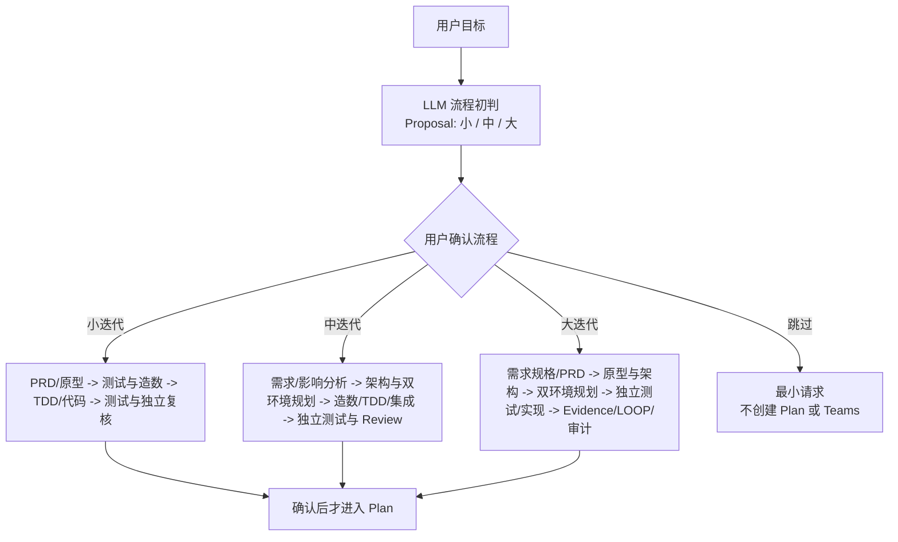

# V2.41 流程澄清协议

启动时先依据用户目标、已提供材料和可验证工作区事实给出 `Proposal`；不得把 LLM 推断伪装成用户已经确认的规模或流程。确认前不得创建正式 Plan、Teams 表或派发 subagent。

## 用户可见格式

```markdown
LLM 的判断是：你应该使用**小迭代流程**来完成。

判断原因：这是范围明确的单点改动；未识别到跨系统、生产发布或高风险边界。

1. 小迭代流程如下：
   -> 生成 PRD 和页面原型（如有 UI）
   -> 生成测试用例及造数
   -> 生成 TDD 及代码
   -> 完成测试用例和独立复核

2. 中迭代流程如下：
   -> 生成需求卡、PRD 和影响分析
   -> 生成 Architecture Design，以及开发/生产环境配置规划
   -> 生成页面原型（如有 UI）、测试用例及造数
   -> 生成 TDD、代码和 API/模块集成
   -> 完成单元、集成或 E2E 测试，并进行独立 Review

3. 大迭代流程如下：
   -> 流程澄清、需求卡、需求规格卡和 PRD
   -> 生成页面规格卡/原型（如有 UI）与 Architecture Design
   -> 在每份 Architecture Design 中规划开发和线上正式环境配置
   -> 独立生成测试设计、造数、TDD/测试脚本和 Harness
   -> 分工实现、执行单元/API/E2E 测试，记录 Evidence
   -> 独立 Review、LOOP 补缺、发布就绪检查和完成审计

请选择下一步：
1. 采用建议的小迭代流程
2. 改用中迭代流程
3. 改用大迭代流程
4. 自定义要保留或删除的流程节点
5. 不使用 Goal Teams 流程，只完成当前最小请求
```

## 流程图



不支持 Mermaid 的宿主必须输出同构 ASCII 图，不能省略流程图。

## 选择原因

| 流程 | 适用情况 | 原因 |
| --- | --- | --- |
| 小迭代 | 单一、低风险、无跨模块/API/生产发布影响 | 以 PRD、最小测试造数和独立复核约束范围；不为局部变更制造完整架构或发行仪式。 |
| 中迭代 | 多模块、API/数据边界、原创 UI、风险中等或有环境配置差异 | 增加影响分析、条件架构和双环境规划，避免配置或集成问题在编码后才暴露。 |
| 大迭代 | 多系统、发布、生产变更、安全敏感、支付/认证、复杂 UI 或高风险 | 完整的独立测试、Evidence、Review、LOOP 与审计链降低协作与上线风险。 |

用户选项 1–4 才能生成结构化 `project_size` 和节点选择，并进入原有 Plan。选项 5 记录 `flow_selection=skipped`，只完成当前最小请求；安全、授权和上层 fail-closed 规则仍然有效。
